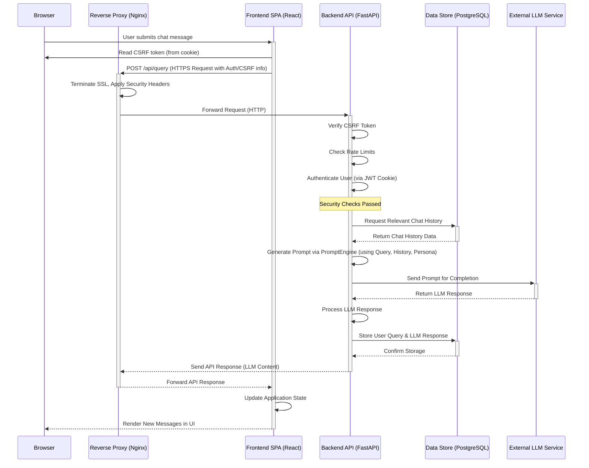
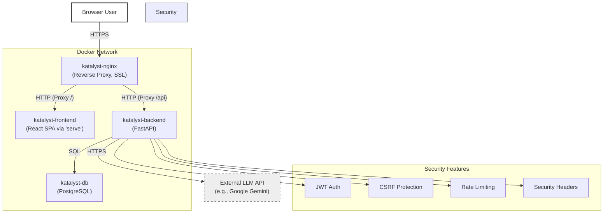

# Katalyst Assistant - Architecture Overview

This document outlines the technical architecture of the Katalyst Assistant application.

## Core Principles

*   **Containerization:** All components (frontend, backend, database, proxy) are containerized using Docker and orchestrated with Docker Compose for consistent development and deployment environments.
*   **Separation of Concerns:** A distinct frontend (React SPA) interacts with a dedicated backend API (FastAPI), which handles business logic and data persistence.
*   **Scalability (Basic):** While designed for demo purposes, the containerized nature allows for potential scaling of backend/frontend services independently if needed in the future.
*   **Security:** 
    *   HTTPS enforced via Nginx
    *   JWT-based authentication with secure cookie storage
    *   CSRF protection using double-submit cookie pattern
    *   Configurable rate limiting per endpoint
    *   Security headers (CSP, X-Frame-Options, etc.)
    *   Cookie security attributes (HttpOnly, Secure, SameSite)

## Components

The application consists of four main containerized services defined in `docker-compose.yml`:

### 1. Frontend (`katalyst-frontend` service)

*   **Description:** A React Single-Page Application (SPA) providing the user interface.
*   **Technology:** React, TypeScript, Create React App (build tooling).
*   **UI:** Chakra UI component library.
*   **State Management:** React Query (server state), React Hooks (`useState`, `useEffect` for local state).
*   **Responsibilities:**
    *   User Authentication UI (Login, Registration).
    *   Chat Interface (Displaying messages, handling user input, persona selection).
    *   Chat History Sidebar (Listing and selecting past sessions).
    *   Making asynchronous API calls to the backend using Axios.
    *   Rendering Markdown responses from the assistant.
    *   Handling CSRF tokens for state-changing operations.
    *   Sanitizing Markdown responses using DOMPurify before rendering to prevent XSS.
*   **Serving (Internal):** The production Docker image builds static assets (`npm run build`) and uses the `serve` package to serve them on port 3000 within the container.

### 2. Backend (`katalyst-backend` service)

*   **Description:** A Python API handling business logic, data persistence, and LLM interaction.
*   **Technology:** Python, FastAPI framework, Uvicorn (ASGI server).
*   **Responsibilities:**
    *   Provides RESTful API endpoints (`/api/...`).
    *   User registration and authentication (password hashing with `passlib`, JWT generation/validation with `python-jose`).
    *   CRUD operations for chat sessions and messages.
    *   Interaction with the PostgreSQL database via SQLAlchemy ORM.
    *   Prompt generation based on user query, persona, and history (`PromptEngine`).
    *   Communication with the external LLM API (Google Gemini) via `aiohttp` (`EnhancedLLMWrapper`).
    *   Configurable rate limiting per endpoint (`SlowAPI`).
    *   CSRF protection implementation.
    *   Security headers middleware.
*   **Security Features:**
    *   JWT tokens stored in HttpOnly cookies
    *   CSRF tokens in non-HttpOnly cookies
    *   Rate limiting with configurable limits per endpoint
    *   Security headers (X-Content-Type-Options, X-Frame-Options, X-XSS-Protection, HSTS)
    *   Cookie security attributes (HttpOnly, Secure, SameSite)
*   **Serving (Internal):** Runs on port 8000 within the container.

### 3. Database (`katalyst-db` service)

*   **Description:** PostgreSQL database for persistent storage.
*   **Technology:** PostgreSQL (official Docker image `postgres:14-alpine`).
*   **Responsibilities:**
    *   Stores user data (usernames, hashed passwords, roles).
    *   Stores chat session metadata (ID, title, user ID, timestamps).
    *   Stores chat messages (user queries, assistant responses, timestamps, associated session/user).
*   **Persistence:** Uses a named Docker volume (`katalyst-assistant_postgres_data`) mapped to `/var/lib/postgresql/data`.

### 4. Reverse Proxy (`katalyst-nginx` service)

*   **Description:** Nginx acting as a reverse proxy and HTTPS termination point.
*   **Technology:** Nginx (official Docker image `nginx:alpine`).
*   **Responsibilities:**
    *   Single entry point for browser requests (listens on ports 80 and 443).
    *   Redirects HTTP (80) traffic to HTTPS (443).
    *   Handles SSL/TLS termination using provided certificates (`nginx/ssl/`).
    *   Serves the static frontend assets by proxying requests for `/` to the `katalyst-frontend` service (`http://frontend:3000`).
    *   Routes API requests (`/api/...`) to the `katalyst-backend` service (`http://backend:8000`).
    *   Applies security headers (CSP, X-Frame-Options, etc.) defined in `nginx/nginx.conf`.

## Data Flow Example (User sends a message)

1.  User types message in React UI -> `handleSendMessage` triggered.
2.  Frontend retrieves CSRF token from cookie and includes it in request header.
3.  Frontend makes `POST` request to `https://localhost/api/query` with CSRF token.
4.  Nginx (`katalyst-nginx`) receives request on port 443, handles SSL.
5.  Nginx matches `location /api` and proxies request internally to `http://backend:8000/api/query`.
6.  FastAPI (`katalyst-backend`) receives request:
    *   Validates CSRF token
    *   Checks rate limits
    *   Authenticates user via JWT cookie
7.  Backend retrieves relevant chat history from PostgreSQL (`katalyst-db`).
8.  Backend constructs a prompt using user message, history, and selected persona.
9.  Backend sends prompt to external LLM API (e.g., Google Gemini).
10. Backend receives LLM response.
11. Backend saves user message and LLM response to PostgreSQL (`katalyst-db`).
12. Backend sends formatted LLM response back through Nginx to the browser.
13. React frontend receives the response and updates the UI.
## High-Level Sequence Diagram (User Sends Message)

## Security Implementation

### Authentication & Authorization
*   JWT tokens stored in HttpOnly cookies
*   Token expiration configurable via `ACCESS_TOKEN_EXPIRE_MINUTES`
*   Role-based access control for different user types

### CSRF Protection
*   Double-submit cookie pattern
*   CSRF token stored in non-HttpOnly cookie
*   Token validation for all state-changing operations
*   Frontend includes token in request headers

### Rate Limiting
*   Configurable per endpoint via environment variables
*   Default rate limit for unspecified endpoints
*   Can be globally enabled/disabled
*   Limits applied to:
    *   Authentication endpoints (login, register, logout)
    *   Query endpoints (authenticated and public)
    *   Chat session operations

### Cookie Security
*   HttpOnly flag for sensitive cookies
*   Secure flag for HTTPS-only
*   SameSite attribute (configurable)
*   Domain restriction support

## Diagram (Mermaid Component Diagram)

This architecture provides a clear separation between presentation, logic, and data layers, with comprehensive security measures suitable for both development and production environments.